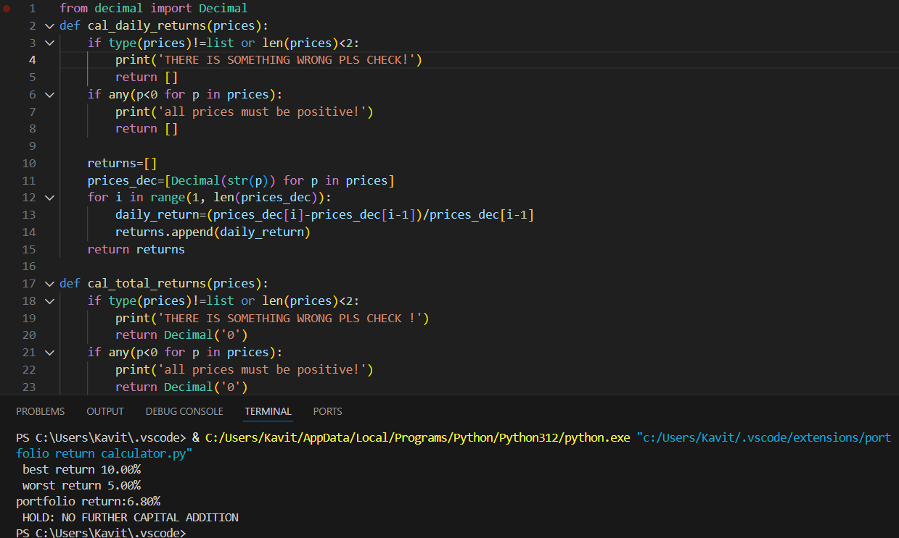

# Portfolio Return Calculator

A basic Python tool I built to calculate daily/total stock returns, portfolio weighted return, and a simple risk indicator.

### Features
- Precise calculations using `decimal.Decimal` (no float rounding errors)
- Input validation (list type, length ≥2, positive prices)
- Weighted portfolio return with length & sum checks
- Basic risk flag (high volatility if any day < -30%)
- Safe error handling with messages
- using yfinance real world data
### How to Run
```python
# Fetch
reliance = get_prices('RELIANCE.NS')
hdfc = get_prices('HDFCBANK.NS')
tcs = get_prices('TCS.NS')

prices = {'RELIANCE': reliance, 'HDFC': hdfc, 'TCS': tcs}

# Total returns (once)
total_returns = cal_total_returns(prices)

# Portfolio
portfolio_return = cal_portfolio_ret(total_returns, [0.4, 0.3, 0.3])

# Daily returns
daily_returns = cal_daily_returns(prices)

# Print everything nicely

print(f"Portfolio Return: {float(portfolio_return * 100):.3f}%")
print(investment_analysis(total_returns, [0.4, 0.3, 0.3]))
print(best_worst_stock(total_returns))
print(risk_indicator(daily_returns))  # fix this function first

### What I Learned

Why float is dangerous for money → switched to Decimal
Importance of input validation to prevent crashes/wrong results
Iterative improvement based on feedback by grok made the core myself taken help to polish my project

Built with
Python (Udemy Complete Python Bootcamp by Jose Portilla – certificate earned)
### Example Output

